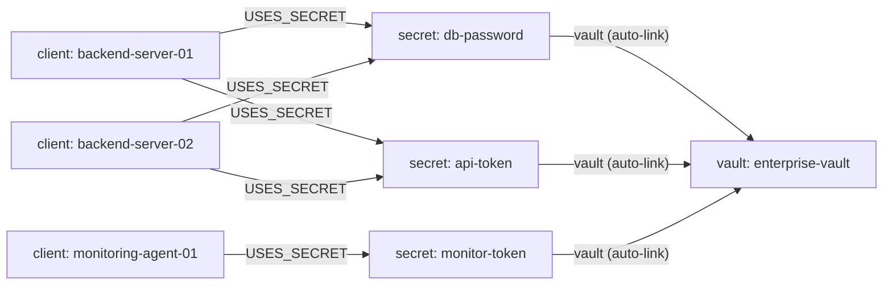
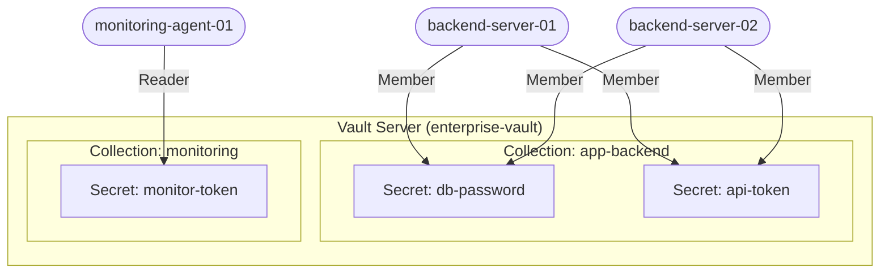

# Graph-Native Secrets Architecture with Rescile Vault

This repository demonstrates how to implement a **Graph-Native Secrets Architecture** using the built-in **Rescile Vault** — a Zero-Knowledge, End-to-End Encrypted (E2EE) secret management solution. The graph acts as the **Control Plane**, defining which clients consume which secrets, while the Vault acts as the **Data Plane**, storing only encrypted blobs it can never read.

The real power emerges when your infrastructure graph defines its own dependency topology: the graph knows which clients need which secrets before those clients even exist, enabling fully automated, zero-knowledge pre-provisioning workflows.

---

## Quick Start

Enable the built-in Vault server by passing the `--vault` flag when starting `rescile-ce`:

```bash
rescile-ce --vault data/vault.json serve
```

> If `data/vault.json` does not exist, it will be initialised automatically.

The the UI is then available at `http://localhost:7600`.

---

## How It Works: The Core Ontology

Cryptographic material must **never** exist as plaintext properties in your source CSVs or the resulting JSON graph. Instead, two dedicated resource types and two dedicated relation types form the secrets topology:

### Resources

| Resource | Role | Holds |
| :--- | :--- | :--- |
| `secret` | Logical resource | Metadata only — description, rotation policy, collection grouping. Never cryptographic material. |
| `vault` | Backend resource | The secure storage boundary (Rescile Vault, HashiCorp Vault, AWS Secrets Manager, etc.). |

### Relations

| Relation | Connects | Carries |
| :--- | :--- | :--- |
| `USES_SECRET` | Consumer → Secret | How the secret is injected (e.g. `injected_as = "DB_PASSWORD"`). |
| `STORED_IN` | Secret → Vault | Persistence routing data (e.g. the KV path or collection name). |



---

## Defining the Ground Truth (Assets)

In this demonstration three CSV files define the complete provisioning topology. Rescile's auto-linking creates the graph edges automatically from the column names.

Integrated into a real topology graph, means the graph itself, using model definition creates reasources for clients and secrets.

### `data/assets/vault.csv`

Defines the Rescile-native vault backend. The `provider = "rescile"` property identifies it as a built-in vault and acts as the discriminator in output templates.

```csv
name,provider,url,description
enterprise-vault,rescile,http://localhost:7600,Primary Rescile Vault for automated provisioning
```

### `data/assets/secret.csv`

Defines logical secrets — metadata only, never cryptographic material. The `vault` column auto-links each secret to its vault. The `collection` field groups secrets that share the same access boundary (i.e., the same set of clients).

```csv
name,vault,collection,description,pre_seed
db-password,enterprise-vault,app-backend,Database password for the backend tier,true
api-token,enterprise-vault,app-backend,External API token for the backend tier,false
monitor-token,enterprise-vault,monitoring,Datadog ingest token for monitoring agents,true
```

### `data/assets/client.csv`

Defines pre-provisioned client nodes (servers, agents, containers). The `secret` column auto-links each client to its secrets via `USES_SECRET` edges. Multiple secrets are comma-separated. The `vault_role` column controls RBAC on the collection.

```csv
name,secret,vault_role,description
backend-server-01,"db-password,api-token",Member,Primary application server
backend-server-02,"db-password,api-token",Member,Secondary application server
monitoring-agent-01,monitor-token,Reader,Monitoring agent — read-only
```

---

## Graph-Driven Provisioning Workflow

Because the graph already encodes the full `vault → secret → client` dependency topology, Rescile can automatically generate both the orchestrator seed script and the per-client boot scripts. No manual wiring required.

### The Bootstrapping Challenge

Standard vaults are excellent for runtime storage. But bootstrapping access to them securely requires a "vault for the vault." Rescile Vault solves this with the **Zero-Knowledge Invite Token Pattern**:

1. An orchestrator (CI/CD pipeline or admin machine) authenticates and creates vault **collections**.
2. Secrets that require pre-seeding are seeded — or auto-generated on first access.
3. The orchestrator issues **time-bound invite tokens** for every client node linked to each collection. This happens *before* the clients boot.
4. During their automated boot sequence (e.g. `cloud-init`), client nodes use their invite token to claim access, generate a local asymmetric keypair, and retrieve the pre-seeded secrets — entirely client-side, without the server ever seeing plaintext.

### Output Model: Orchestrator Seed Script (`data/output/provision_vault.toml`)

Iterates over `vault` resources where `provider = "rescile"`. For each vault it:

1. Creates collections (grouped by the `collection` field on each secret).
2. Pre-seeds secrets marked `pre_seed = true` (omitting the value triggers auto-generation of a strong random secret).
3. Issues invite tokens for every client linked to secrets in that collection.
4. Enforces `Reader` role for clients declared as read-only.

The generated script (`seed-enterprise-vault.sh`) is downloadable via the REST API once the graph is built.

### Output Model: Per-Client Consumption Scripts (`data/output/provision_clients.toml`)

Iterates over every `client` resource and generates a boot-time provisioning script. Each script:

1. Sets the client identity and vault URL (traversed from `secret → vault`).
2. Claims the invite token — either from the injected `RESCILE_VAULT_INVITE_TOKEN` environment variable or via automatic discovery (`GET /vault/v1/invite/<client-name>`).
3. Retrieves every secret the client needs, using the `collection` property for routing.
4. Writes the retrieved secrets to the local workload configuration.

---

## Vault Hierarchy and Access Control



Access to collections is governed by strict RBAC. Clients hold one of three roles:

| Role | Permissions |
| :--- | :--- |
| **Owner** | Full administrative rights: read/write secrets, invite clients, change roles, delete collection. A collection must always have at least one Owner. |
| **Member** | Read and write secrets. Default role when a client claims an invite token. |
| **Reader** | Read-only access. Ideal for target machines where secrets are pre-seeded. |

---

## Zero-Knowledge Architecture

The Rescile Vault server stores only encrypted blobs. It has **no access to plaintext keys or secrets at any point**. All cryptographic operations — key derivation, encryption, decryption — happen exclusively on the client side:

- Each client generates its own local asymmetric keypair on first use.
- The Collection Key is wrapped (encrypted) against each client's public key individually.
- Multiple consumers can share access to the same collection without sharing credentials or re-encrypting the underlying secrets.
- Revoking one client's access does not affect other clients.

For highly secure production environments, the Rescile Enterprise platform supports **native TPM (Trusted Platform Module)** binding, hardware-binding the client's private key and session secrets to the physical machine so they cannot be exfiltrated even if the root filesystem is compromised.

---

## Querying the Provisioning Topology

Once the graph is built, verify the full provisioning topology with a single GraphQL query before a single server boots:

```graphql
query VaultProvisioningTopology {
  vault(filter: { provider: { eq: "rescile" } }) {
    name
    url
    secret {
      node {
        name
        collection
        pre_seed
      }
    }
  }
  client {
    name
    vault_role
    secret {
      node {
        name
        collection
      }
    }
  }
}
```

This returns every Rescile-managed vault with its secrets, and every client with the secrets it consumes — a complete, auditable view of who has access to what.
